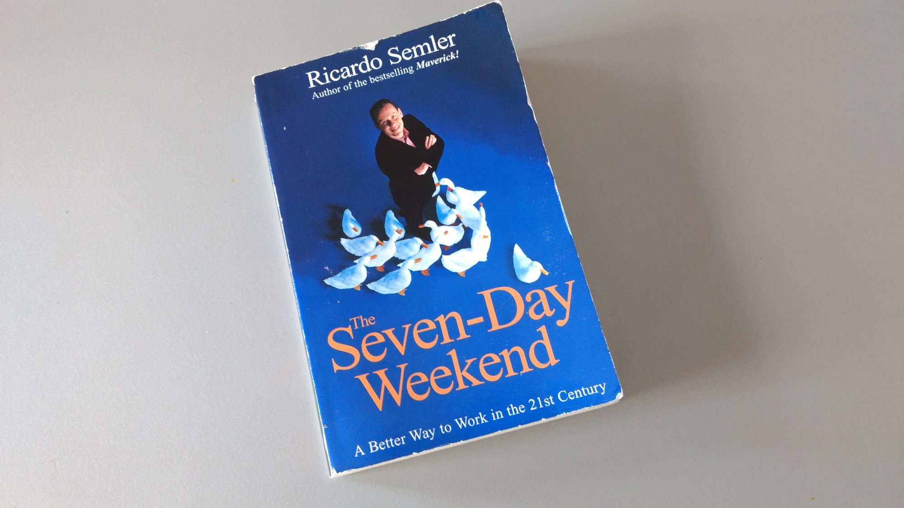

In [The Seven Day Weekend][sdw], Ricardo Semler explains in plain english his
very pragmatic approach to building a company that survives radical market
transformations while keeping its employees fully invested in constant
improvements, change and new ventures. His philosophy is radical: if a problem
or conflict arises, _do nothing_. Given enough trust, information and time, the
employees will find a solution to any problem that might not always be better
then one thought up by top-level managers but always will find a broad
acceptance within the workforce and thus getting accepted and integrated as
quickly as possible.

What is also clear, though, it's hard to run a company after Semcos example:
removing artificial growth goals, not being able to control everything, and
trusting your employees and their instincts is nothing today's managers are
prepared for. Schools, universities and companies are systems that still teach
the opposite of what Ricardo Semler so easily debunks as an illusion: the idea
that you can plan for the future.

This book is fascinating and provides in many anecdotes an insight into a truly
new way of managing organizations, and that is what makes it so powerful. Semco
is proof that there are robust and successful alternatives to
command-and-control-structures.

[sdw]: http://amzn.to/2fdxqrD
