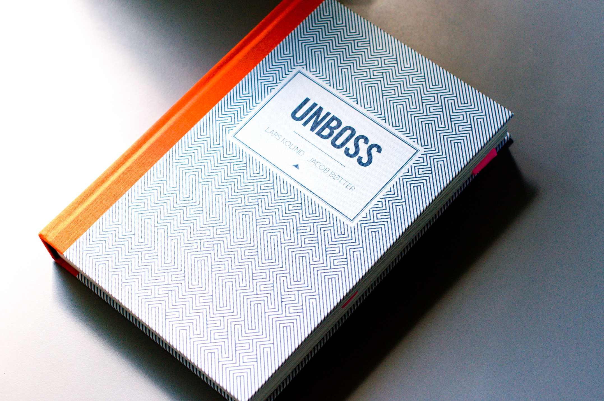

[Unboss][1] is a remarkable book. [Lars Kolind][2], [Jacob Bøtter][3] and over
60 contributors created a blueprint for future organizations. Instead of
offering bite-sized action-plans like many other books dealing with
organizational development _Unboss_ explains underlying principles and reasons
_why_ organizations need to change and establishes a solid foundation explaining
_how_ to build the next generation of organizations and work for the next
generation of workers: those that truly care for meaningful relations,
purposeful work and global sustainability.

They don't try to offer a simple change-plan because an _unbossed_ orgnization
is so radically different from the orgnizational model that was established over
a hundred years ago that any attempt to offer a smooth transition is futile.

This could be the reason why _Unboss_ has not seen much interest since its
publiation in 2012, and hard-copies are not easy to aquire. It's a whopping 310
pages and due to it's questionable use of typographic ornaments to highlight
certain key phrases it is not an easy read. But believe me, it is worth it.

Its great value lies in finding words for a gut feeling: there is something
fundamentally wrong with established industries. Most organizations are running
full steam into disasters because they stick to their traditional management
models. Recent events like the VW scandal are just the tip of the iceberg. We
now see it loosing some chunks. Soon, more and more chunks will break off until
suddenly the whole iceberg flips around. Those that are on top now will vanish
without knowing what hit them.

In chapters like _Unboss communications_ the book proposes a new way to
integrate employees, customers and partners into the dialoge with the customer.
Information must flow freely and decisions must be made where they are the most
effective not where an artificial hierarchy has appointed the _appropriate_
point of contact. Enabling everybody to hold honest conversations, internally
and externally, requires know-how and information to be available to anybody.
Most organizations still work with need-to-know models that protect and enable
power over others through conceiling and controlling the flow of information.
_Unbossing_ the communication means that this power must vanish but this calls
for answers to the fears of mid-level managers losing their power; they need new
and better ways to get what they truly strive for: the appreciation of their
coworkers.

This is the hard part when changing organizations. It can't be answered in a
book. The _What_ is up to you!

[1]: http://unboss.com/
[2]: https://twitter.com/kolind
[3]: https://twitter.com/boetter
