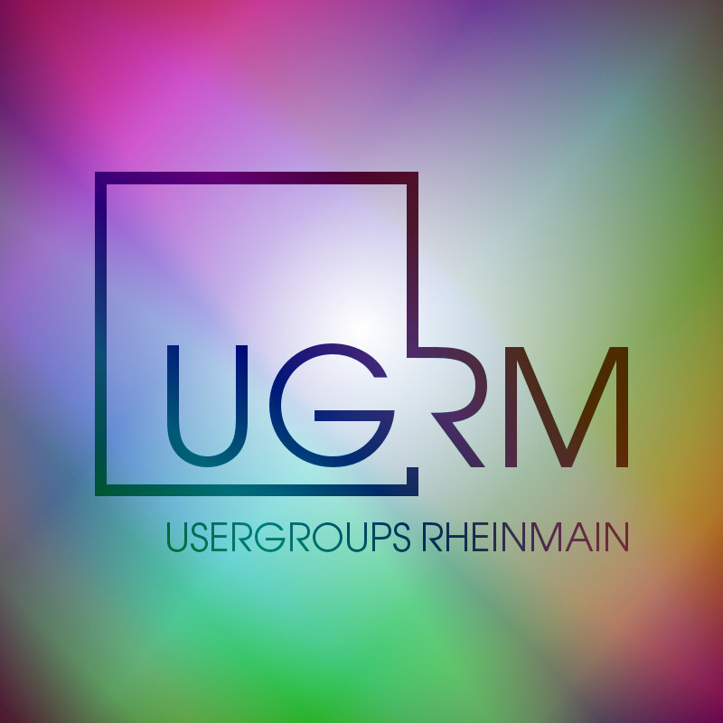

[][1]

Unter [usergroups.rheinmainrocks.de][1] habe ich ein Projekt gestartet, dessen
Ziel es ist, einen umfangreichen Überblick über das Angebot der
Technologie-Usergroups im Rhein-Main-Gebiet zu geben. Der konkrete Mehrwert
besteht darin, dass die Daten zu den Usergroups von jedem selber gepflegt werden
können. Es wird lediglich ein GitHub-Account benötigt.

Auf dem Webmontag #47 am 8. April 2013 werde ich einen [Ignite-Vortrag][2] zum
Thema Usergroups halten. Darin werde ich versuchen, ein möglichst komplettes
Bild der im Rhein-Main-Gebiet aktiven Usergroups zu zeigen. Zur Vorbereitung für
den Vortrag muss ich natürlich Informationen zu den Usergroups sammeln. Ein
Einstiegspunkt bietet die ausführliche Auflistung auf
[RheinMainRocks.de/usergroups][3]. Praktischerweise hat die Linux-Usergroup
Frankfurt gerade ein Großtreffen aller Usergroups im Rhein-Main-Gebiet
angestoßen, Details dazu finden sich [hier][4].

Um aus diesen ganzen Bestrebungen etwas nachhaltiges zu schaffen habe ich nun
das UGRM-Projekt gestartet. Kern des Projekts bildet ein [GitHub-Repository mit
XML-Daten][5], das zum einen frei verfügbar ist, aber auch die Pflege der Daten
durch jedermann ermöglicht und dabei den Aufwand zur Einpflege von neuen
Einträgen und Änderungen auf ein Minimum reduziert. Mit Hilfe von Pull Requests
können Daten zum Projekt beigesteuert werden, die sich in der Regel mit nur
einem Mausklick in die Stammdaten übernehmen lassen. Dafür sorgt vor allem, dass
die Beschreibung der Usergroups mithilfe von XML erfolgt und so eine feste
Struktur vorgegeben ist. Dies erleichter erheblich das Anlegen und Überprüfen
der Daten – ein [XML-Schema][6] gibt den Rahmen vor.

Die Visualisierung der Daten erfolgt unter [usergroups.rheinmainrocks.de][1]  –
der zugehörige Quellcode ist ebenfalls [frei auf GitHub verfügbar][7]. Auch hier
sind Pull Requests gerne willkommen.

Nun sind alles Technologie-Usergroups aus dem RheinMain-Gebiet aufgerufen, ihren
Einträge anzulegen oder zu erweitern, Logos zur Verfügung zu stellen und ein
Foto der Gruppe auf dem nächsten Treffen zu machen. Neben den reinen statischen
Informationen zur Usergroup können auch die nächsten Termin hinterlegt werden.
Der [Eintrag der PyUGRM][8] zeigt die volle Ausprägung  der anzeigbaren Daten.

[1]: https://usergroups.rheinmainrocks.de/
[2]: http://en.wikipedia.org/wiki/Ignite_(event)
[3]: http://RheinMainRocks.de/usergroups
[4]: http://www.lug-frankfurt.de/FrUsKon
[5]: https://github.com/rheinmainrocks/ugrm-data
[6]: https://github.com/rheinmainrocks/ugrm-data/blob/master/xsd/usergroup.xsd
[7]: https://github.com/rheinmainrocks/ugrm
[8]: https://usergroups.rheinmainrocks.de/usergroup/pyugrm
