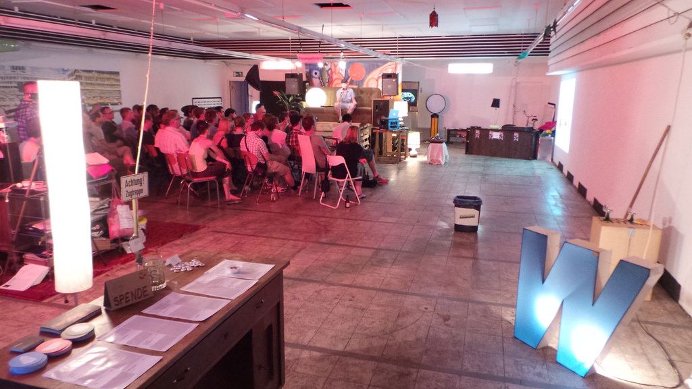

On the next Monday, February 23rd 2015, I'll be at a run-down place that used to
be a super market and hosting the 10th Webmontag Offenbach.

While compiling the impressively long line-up for the newsletter which I send
out before the event to the people who have registered on
[Webmontag Offenbach's website](http://wemoof.de) I realized that it is time to
celebrate a little.

It all started over two years back when I bitched once again about the
[Webmontag Frankfurt](http://wmfra.de/) beeing on the other side of Frankfurt
and I wanted to have a similar event in Offenbach. Up until today we are still
the only community-driven, non-profit tech-event in Offenbach!

Getting it started was easy: I set a date and spread the word about it. Just a
few days afterwards I was approached by [Lutz Jahnke](http://jahnkedesign.com/),
who owns the location WEMO♥F has been guest at now ever since: the
[afip!](http://www.afip-hessen.de/). This location has been the backbone of the
event and without it the Webmontag Offenbach couldn't be. It's location in the
city center makes it easy to reach by public transport and beeing a former
supermarket it perfectly conveys Offenbach's charme: beeing pragmatic to the
absolute bare minimum.

After the first Webmontag it became harder to attract speakers–this has improved
a lot and we never were short on talks in the end anyway. It's not easy to find
the balance between effort and result for events but I feel that the way I run
the WEMO♥F works out. I focus on delivering a great evening **for the people at
the location**. Everything else is secondary. I default to "No." when it comes
to changes and extras and if they happen, somone else has to take
responsibility, not me. That removes a lot of burden from my mind. And every bit
more you have to take care of for an event will cost you a lot energy, and
always more than you've expected. That's also why there can only be one answer
to the question: "What's next?" Let's do 10 more WEMO♥Fs like we did the last 10
and see …

I'd like to thank everyone who made the Webmontag Offenbach possible, it became
a part of the community work I still enjoy doing.

Now head over and sign up for #10: [wemoof.de](http://wemoof.de/)
