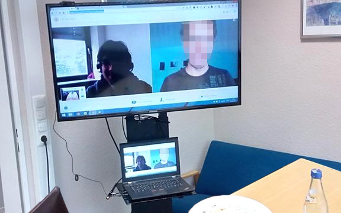

_This post series is a summary of my talk about the challenge working in
distributed teams.
[Find the other parts here.](./working-in-distributed-teams-the-three-most-important-challenges/)_

The watercooler is a symbol for a central place in an office building where
everyone walks by multiple times per day and which enables informal, accidental
meetings.

How important this place is can be seen in this picture: this is the atrium in
the Pixar Headquarter. Steve Jobs himself altered the initial concept of the
architect and placed facilities like the restrooms, cafeterias, meeting rooms
next to each other in a central location to ensure employees need to leave their
seclusion and bump into each other once in while. For Jobs only this would
enable great ideas to form, information to spread and problems to be solved
quickly. It also facilitates building relationships with colleagues and a sense
of belonging. This obviously is lacking if you have no physical office but it is
vital for every creative team to have an insight into what is happening in the
whole organization.

## Working out loud

The way to fix this is probably not new to you but I can’t stress it enough:
**Start working out loud**. You need to provide your coworkers with a constant
stream of information about:

- what you are working on
- what your impediments are

With this information available everyone can start making the connections to
their own projects and contribute to solutions for your problems. This can’t
happen if you are away from your coworkers and only share a finished result of
your work once every other week. Obviously there is the need for a tool for that
and by all means do not use email!

I am having great results by using a team chat like [Slack](https://slack.com/)
for the asynchronous sharing of what’s happening. Even if you don’t know Slack,
you will be familiar with the concept of chat rooms: a tool like Slack enables
you to have as many rooms as you like. This is different to Skype for instance
where you only have a contact list and ad-hoc group chats. In Slack (or IRC if
you like) a history of messages is kept and even if people join a room at a
later point, they can re-read everything that has happened regarding the topic.
Everyone is able to start following a certain topic and can contribute to it.

There are usual three kinds of rooms:

1.  Long-lasting general topic like _#tech_, _#marketing_ and _#hiring_ - I’d
    say they usually emerge around every role you have in your organisation; you
    could say these are communities of practice … but are also used to
    communicate news from these groups to the whole company in a less technical
    way.
2.  Project-specific topics like _#website-relaunch_ or _#our-mobile-app_ in
    which you exchange about the progress of the project, these usually have a
    diverse mix of people from all disciplines.
3.  Short-lived topics like _#launch-of-big-feature_, _#special-event_ which
    deal usually have a high volume of exchange only for a few days and then can
    be discarded.

This granularity helps to better control the amount of information they will
need to consume because following everything is impossible. You need to care
about this! Of course we as developers have channels where every commit from our
repositories is posted, but I don’t get notified about every message in such a
channel, I selectively read them a few times a day. Slack enables you to specify
notification settings per channel and even have different settings depending on
the device so you can have more notifications if you are on your desktop or only
a few important ones if you are traveling. Make sure that the tool you are using
has this type of granularity when it comes to notifications and educate all your
users about them.

## More bandwidth: video chat

So much for the asynchronous part of working out loud but you will also need
something that has a lot more bandwidth than text: video chat.

Everything that develops into a discussion with more than a few messages should
be taken to video. I always enjoy using
[Google Hangouts](https://hangouts.google.com/) but if you don’t want to use
Google services (like we did at my last company) you should check out
[Goto Meeting](http://www.gotomeeting.de/online-meetings/) which is free for
even more than three people and worked for my team very good. Both services
offer a screen sharing option which is a real important feature for
collaboration … and a universal one; yes there is software that enables
real-time collaboration directly in your apps but screen sharing is universal.
If you need to remotely fix things on coworkers computer,
[TeamViewer](https://www.teamviewer.com/) is great. All these tools work
cross-platform which you need to keep in mind, too (and I am neither on Mac nor
on Windows).

Video chat not only has more bandwith than text but it also enables nonverbal
communication which is really important to fully understand each other. We often
used it to hang out together with microphones muted and listening to music but
everyone could just speak up to the room if they had a question. And sometimes
people just need to vent, yes this may sound stupid but there is for instance
something called rubber duck debugging which is a real thing!

## … also for _check-ins_

Besides the ad-hoc meetings for increased bandwidth and the occasional team
hangout during the day I use videochat for all recurring meetings like daily
stand-ups. I call them _check-ins_.

Yes I know that there are tools that can collect daily stand-up information
asynchronously ([iDoneThis](https://idonethis.com/),
[Umantis Daily Highlights](http://marketing.umantis.com/deutsch/daily/),
[a Slack bot](http://www.sofetch.io/products/standup-bot-private/)) but I’m
convinced that you should use every chance you have to actually see and hear
each other.

1.  The _daily standup_ is where everyone states what they are working on and
    what their impediements are. This takes just a minute per person and should
    be done after 15 minutes. Impediments need to be resolved immediately so we
    have reserved an additional 15 minutes after the daily for 1-on-1s to
    resolve any pending issues. Everyone in the team knows to keep this slot
    free for ad-hoc meetings. After that you can spread out again. Because the
    daily stand-ups deal with detailed technical topics we only did them within
    people of the same profession like developers, marketing, business people.
2.  Once a week we then had a _product meeting_ which brought together a wider
    range of people, usually the product owner and if needed other specialists.
    This meeting took between one and two hours on every Monday and was used to
    plan the upcoming week and readjust the backlog.
3.  And finally there were our weekly lunches: Once a week on every Tuesday at
    1pm everyone would gather together for a lunch. This is a great meeting
    because of its informal nature and you have a perfect ice-breaker for free:
    “what are you having for lunch over there?” That’s always fun! During the
    weekly lunch we’d go through every department and provide a brief update of
    what has happened. Bringing everyone together again creates the opportunity
    for cross-chatter and random connections.

By the way: this is a large flatscreen where we connected to our remotees …
what’s especially nice is that this large screen gives them a real physical
presence because it provide a life-size image and a loud sound. And yes, getting
the technology right is always a pain. You need good internet connections,
[good webcams (go for HD!)](http://amzn.to/1m1dVVk) and
[good headsets](http://amzn.to/1m1g1Ez) … don’t go cheap on those.

But occasionally every technology will fail. Usually the internet connection of
one person or the chat or video service entirely … which brings me to my first
protip:

## Protip #1: Have a fallback ready

In our case we usually had problems with the internet connection of one of our
colleagues and some times goto meeting was down. So we made sure that everyone
knew how to switch over to a telephone conference provider. The information was
available in the wiki and as soon as problems arised we quickly switched to the
fallback without much waiting in order to continue quickly without to many
failed attempts. Obviously this requires you to a) find a fallback and b) test
it once in a while. For video conferencing we used [Talky](https://talky.io/) as
an alternative. And alternative for a not working internet connection is using a
different medium, which is phones. [MyTelco](http://www.mytelco.de/) provides
free dial in conference rooms, and usually everyone has flatrates on their
phones these days.

So many tools, I know … That’s why, my second protip is:

## Protip #2: Define a communication escalation process!

What this means is that you establish a common understanding in your team, which
communication tool is used for what. At my last workplace we had these rules:

- Slack is the main communication medium used to push information and to clarify
  questions, it is agreed upon that everyone is free to read messages in Slack
  whenever it suits them. It is asynchronous and everyone must be okay with the
  fact that there may be hours between your question and a response.
- The authorative tool for managing tasks was not Slack but a task tracker (I'd
  recommend Trello). This is where you create an agreement about who is doing
  what and when. If you have an emergency you may call someone on his cellphone
  … and if you can’t answer a cell phone call you are supposed to call back as
  soon as possible.
- We also defined for the IT what classifies as an emergency. Basically only if
  our product was not usable by all our customers, for instance if the server is
  down.
- There was also a special email address you could use to report bugs that
  directly affect individual customers. We guaranteed that emails sent there
  would be dealt with within two hours during regular business hours.

But protip #3 is the most important one:

## Protip #3: Everybody should work remotely, at least some days a week.

And here is why: if you never experience working remote you won’t understand how
it feels to be cut off the water cooler and to not be included in the “offline”
chatter or how important great equipment is. And this is especially true for the
CEOs in every company. Go and scout a coworking space, work from home or even
more crazy: visit your remotees …

## Coming up: quality together-time

The second most important challenge is to ensure that the few occasions you will
spend face-to-face with your colleagues is quality time.
[Read about it in Part 2](./working-remote-quality-together-time/) of
[this series](./working-in-distributed-teams-the-three-most-important-challenges/).
