Having had the change to attend [Øredev](https://oredev.org/) in 2019 as a
speaker I was hooked; this conference is one of the few commercial conferences
that I have truly enjoyed attending. First, there is a fantastic team of
organizers who have created this conference to strengthen the tech scene in
Malmö; the main goal therefore is to connect the local tech scene with an
international audience and not like on many other for-profit conference to boost
a brand or product ecosystem. It's about people.

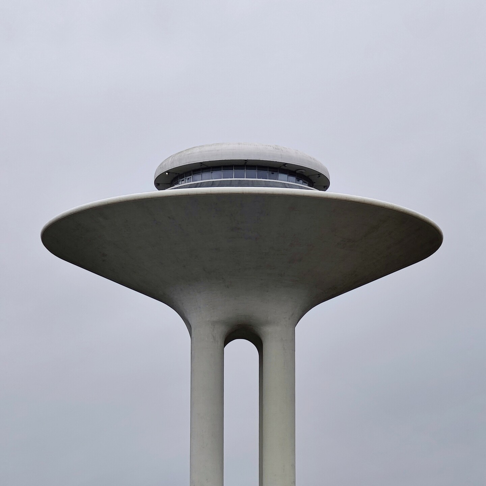

This is also clearly visible in the way sponsors (at Øredev called partners)
interact with attendees: most bring developers to their booth, because direct
solicitation to hiring is not allowed by the organizers. That meant that I had
the opportunity to talk directly with developers, and founders from companies
like [INGKA](https://www.ingka.com/), [55degrees](https://www.55degrees.se/),
and other small and large companies and learn about the way they work, the tools
they use and how they collaborate. For me this is an important aspect of going
to a conference... meeting new people in my industry and building new
connections.

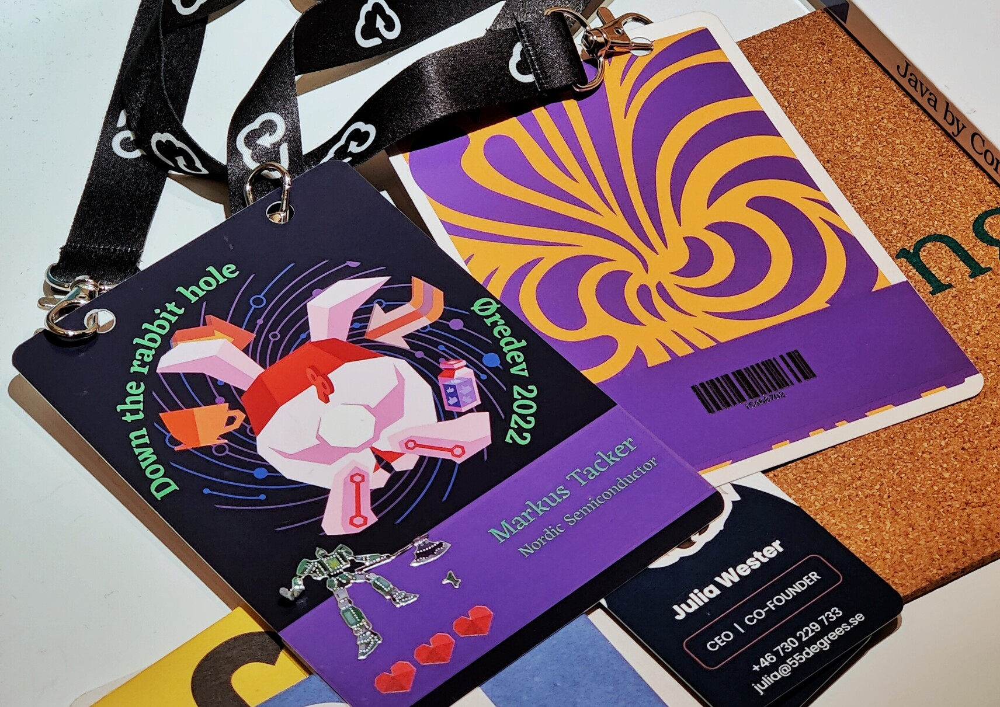

Another cool detail I want to mention: the attendee badges were intentionally
designed in a way that made it hard to read names from a distance, so sponsors
could not just snap a quick picture but had to ask for getting close to the
badge in order to see the name. The QR code on the back that gives access to the
attendee details is also not easy to scan. The organizers encouraged sponsors to
have real conversations and not hunt for contacts. Which in my experience worked
very well.

But of course, the main reason I go to conference is to get insights into topics
that are or will be relevant to my work. So let's recap the talks I've seen. By
the way, this was the first time that I've attended a conference
[without using Twitter](/leaving-twitter). During the conference
[I've used Mastodon to share about the sessions I went to](https://chaos.social/@coderbyheart/tagged/oredev).
There were very few attendees and speakers who used this social network, so the
ability to connect to others was definitely impacted, but I think it is only a
matter of time until Twitter is no longer the main social media platform in use
at conferences (actually there were
[quite some posts on LinkedIn tagged with #oredev](https://www.linkedin.com/feed/hashtag/?keywords=oredev)).

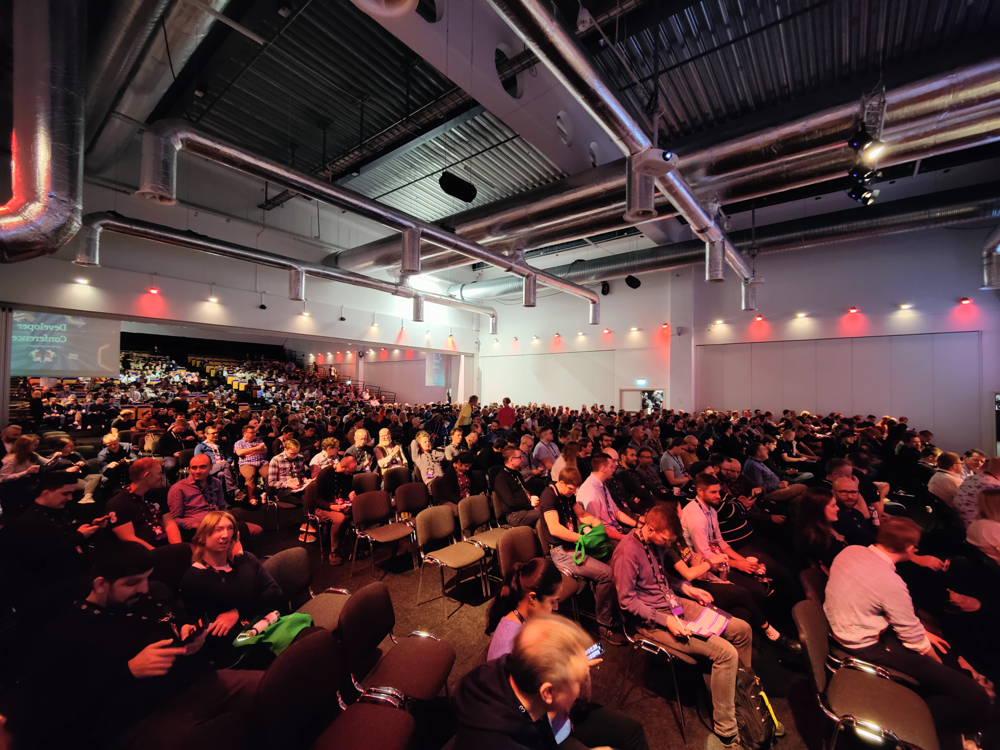

## Opening Keynote: Always time for tea (Allan Kelly)

[Allan Kelly](https://www.allankelly.net/) gave the opening keynote. He talked
about how we can optimize time spent on projects, and how bad humans are a
estimating time. But they are good at working against deadlines. The more closer
to a deadline we are the better we are in finishing on time. Deadlines work best
when they are in short, repeating intervals ... like the Sprints of Scrum.

Working against short deadlines also gives you the opportunity to release a
working product and start creating revenue quickly. Now, looking at how we
structure the work to be done Allan points out that Backlogs are bad, because
they do not scale. They just keep growing. What is needed is a clear vision so
what needs to be done next can be identified when the current work item is done.
Having (and knowing) the higher purpose is in the end more profitable than
focusing on profits alone ... because plans never work, they are rarely good,
and when a plain fails, it's demoralizing.

But don't forgo planning, it's effective for small iterations, but don't overdo
it.

Allan closes with a call to have small, lightweight planning processes, because
they are both more humane and effective.

I mostly got [my project planning philosophy](http://slap.pm/) confirmed during
this talk.

🐘 [Toot](https://chaos.social/@coderbyheart/109307388706060346)

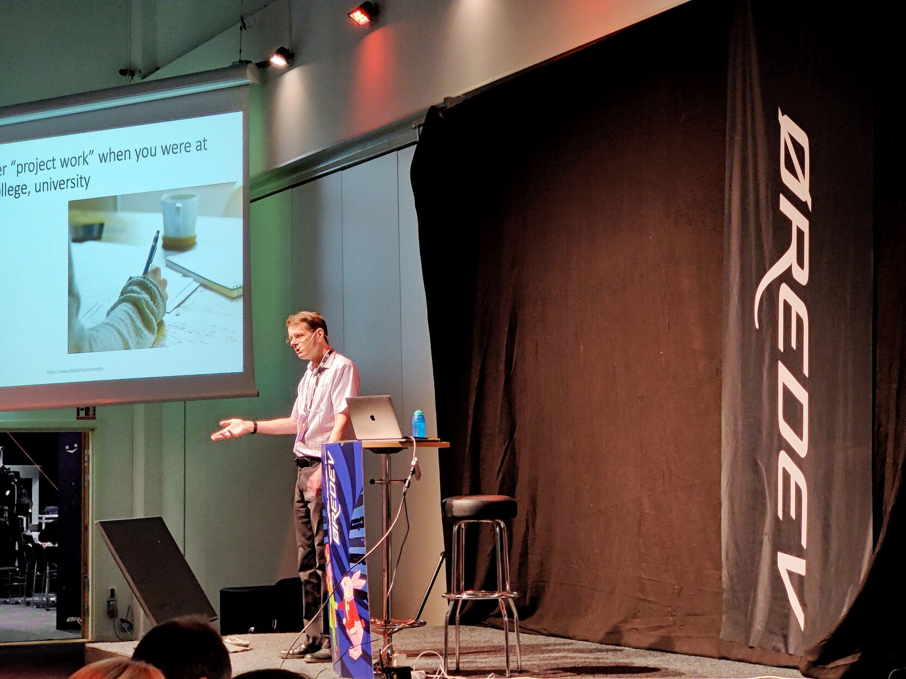

## Four years of team self-selection at Redgate Software (Chris Smith)

[Chris Smith](https://www.linkedin.com/in/chrissmithagile/)'s
[talked about how Redgate enables employees to regularly change teams](https://oredev.org/sessions/four-years-of-team-self-selection-at-redgate-software)
despite its commonly assumed that changing teams is hurtful for productivity.
However for Redgate is not. It actually helps to distribute knowledge and
culture, and helps people to change teams to support their personal development.

**Main takeaway:** Regular re-teaming can help to spread knowledge in the
organization and make onboarding of new employees much smoothers.

🐘 [Toot](https://chaos.social/@coderbyheart/109307867879571977)

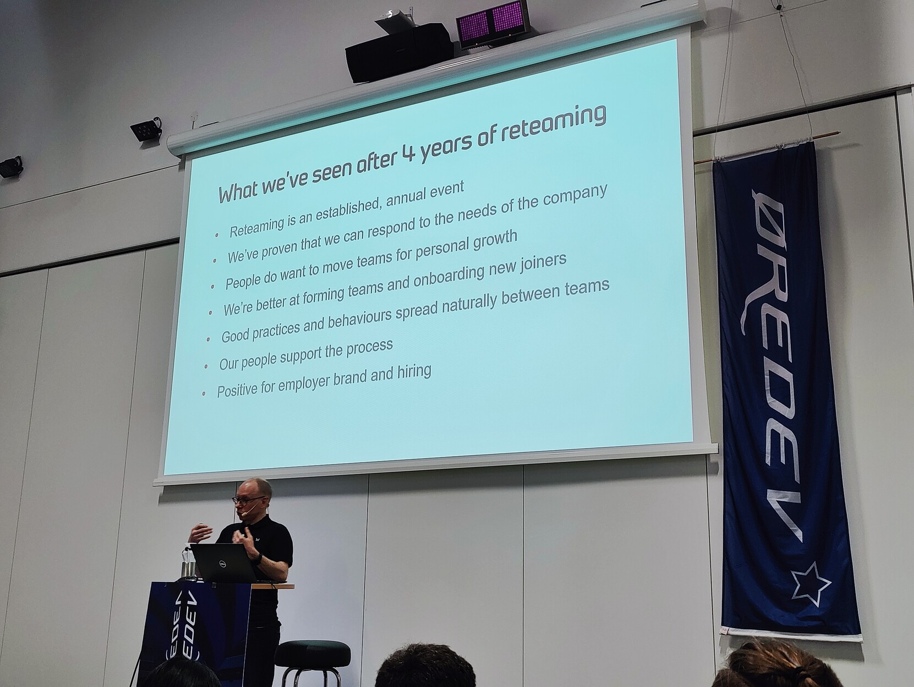

## Aligning Architecture with Responsibility Indices (Michael Feathers)

In
[his talk](https://oredev.org/sessions/aligning-architecture-with-responsibility-indices)
[Michael Feathers](https://michaelfeathers.silvrback.com/) talked about
Responsibility Indicies.

He elaborated how we can create understanding for a software system that allows
us to reason about which components are responsible for which business task.

He mentions
[Object Design: Roles, Responsibilities, and Collaborations](https://www.wirfs-brock.com/DesignBooks.html)
by Rebecca Wirfs-Brock where she introduces the concept of responsibility driven
design.

My **main takeaway** from the talk was that we tend to look at systems from the
perspective of responsibilities and until now it seems that we didn't pay enough
attention to that. And many techniques (like architecture diagrams, use cases,
DDD) focuses on creating an inventory of what is there now, but don't contain
the knowledge/vision about what should be.

🐘 [Toot](https://chaos.social/@coderbyheart/109308134052214515)

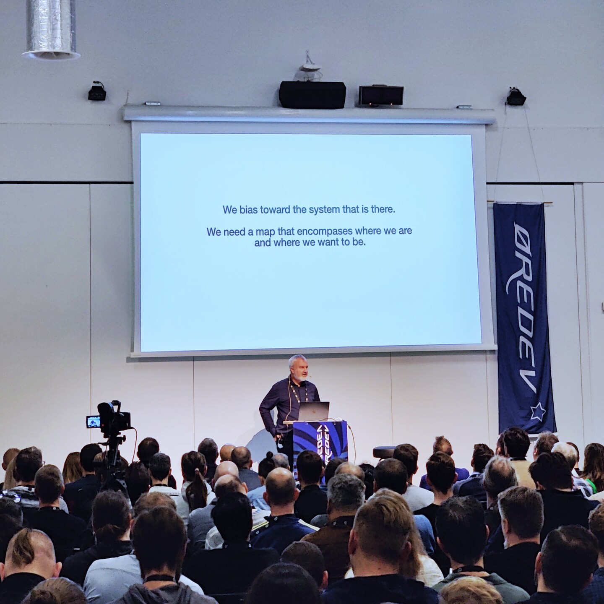

## How to control insanely complex stuff in a simple way (Gojko Adzic)

[Gojko Adzic](https://gojko.net/)
[talks](https://oredev.org/sessions/how-to-control-insanely-complex-stuff-in-a-simple-way)
about feedback systems, which are really everywhere, and a lot of software works
because they use feedback systems.

This talk is inspired by Goijko's reading of the the book Feedback Systems:
[An Introduction for Scientists and Engineers Åström, Karl Johan and Murray, Richard M. (2008)](https://authors.library.caltech.edu/25062/).

Feedback systems can be used in production to detect defects, even if we do not
understand the cause of the problem, but we can look at the behavior of the
system to see if it behaves correctly, or not.

By focusing on business metrics to inform on the health of our system we
decouple the error detection from the implementation and make it more robust and
more easier to understand.

If we apply that to TDD, where the difficultly to write tests for a system is
the sensor, then we are well advised to understand that we need to change the
design of system. The feedback systems however helps us here to only discover
bad design, not good design.

When designing feedback systems there are a few caveats to watch out for.

My **main takeaway** was that we do use feedback systems quite often, and they
can help us to improve complex systems, but understanding the theory behind it
will prevent us from making stupid mistakes.

🐘 [Toot](https://chaos.social/@coderbyheart/109308373572845016)

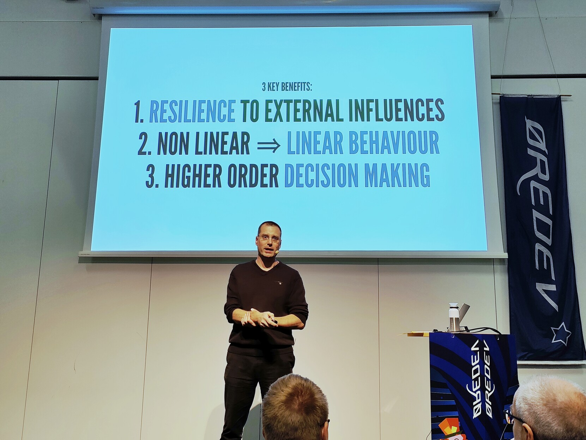

## Deep down the rabbit hole of state management and server cache (Natalia Tepluhina)

[Natalia Tepluhina](https://www.nataliatepluhina.com/)'s talk was very hands-on.
She introduced the state-management library
[TanStack Query](https://tanstack.com/query/v4/) that is available for all
popular frontend frameworks and aims to simplify typical workflows when
interacting with RESTful APIs, similar to the Apollo library for GraphQL APIs.

It was very helpful to get a quick intro to this library and talk to Natalia
about it a bit after her talk.

🐘 [Toot](https://chaos.social/@coderbyheart/109308720296412894)

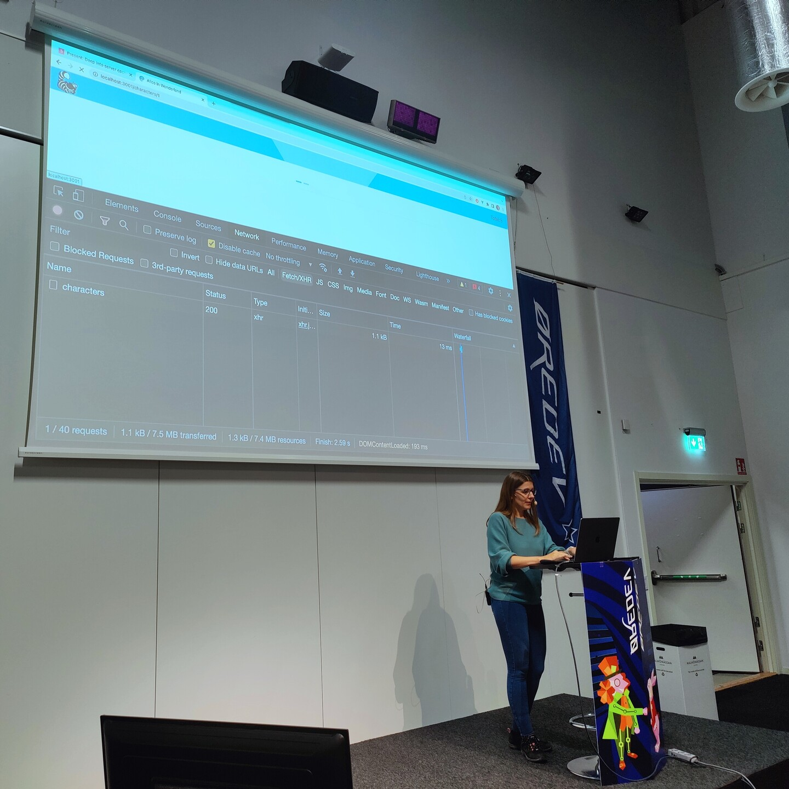

## Opening keynote Day 2: Jenny Radcliffe

The opening keynote is from
[Jenny Radcliffe](https://humanfactorsecurity.co.uk/speaking/) and she talks
about social hacking. I was familiar with her story already from
[this great Darknet Diaries episode](https://darknetdiaries.com/episode/90/)
about her.

🐘 [Toot](https://chaos.social/@coderbyheart/109312876218314967)

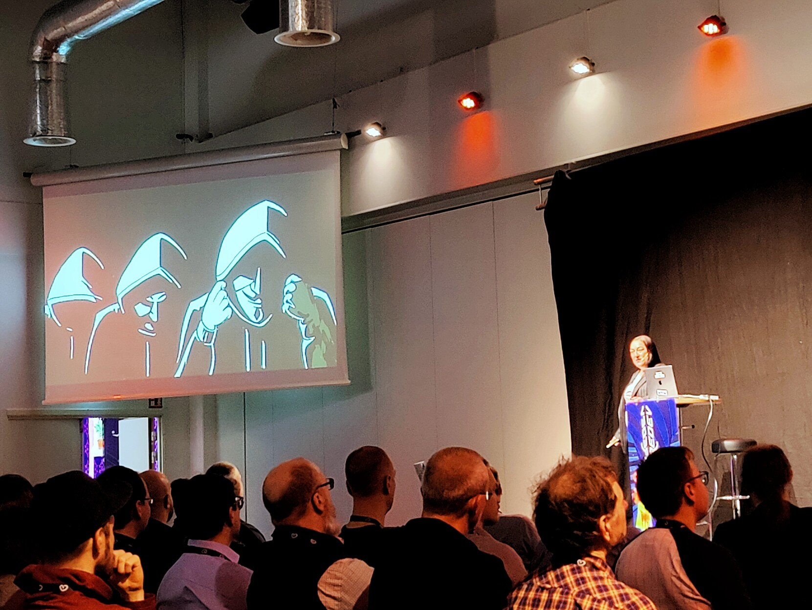

## Reawakening Agile with OKRs (Alan Kelly)

In another #oredev session by Allan Kelly, this time hearing from him about
#OKRs

First, Allan points out that Agile in most organizations is too much bureaucracy
and too little moving the teams towards learning and improving.

OKRs can help here, because they help to formulate the necessary tasks to move
towards the organizations goal.

But they can be easily misused, so watch out for them being used as command &
control in disguise.

However they have the potential to enable teams to work autonomously but still
provide information to other teams about their deliverables. But it shouldn't
cascade (one teams objective depends on another teams key result); it needs to
be combined in collaboration not in dependencies.

If you add #OKRs, don't add them on top of other inputs for what a team works
on, but EVERYTHING must be expressed in OKRs, otherwise they will be effective.

And this can be done every sprint, and can replace your backlog. Imagine how
great this could be if you create alignment within the organization this
consistently.

He wrote a book about it:
[Succeeding with OKRs in Agile (2021)](https://www.amazon.co.uk/gp/product/B08S3DHJJW),
and is for sure worth checking out.

Btw,

My **main takeaway** here was that
[OKRs](https://de.wikipedia.org/wiki/Objectives_and_Key_Results) can only work
well, if

1. everything we do is expressed as OKRs
2. they are created togethers as a team, not on an individual level

Additionally I'd like to mention that this is
[how Morningstar (the tomato company) works](https://hbr.org/2011/12/first-lets-fire-all-the-managers):
there teams create contracts every year between each other.

For me this sounds that ideally teams are re-teamed every time OKRs are defined.
I asked Alan about it during lunch and he didn't have experience with that, yet.

🐘 [Toot](https://chaos.social/@coderbyheart/109313235560797191)

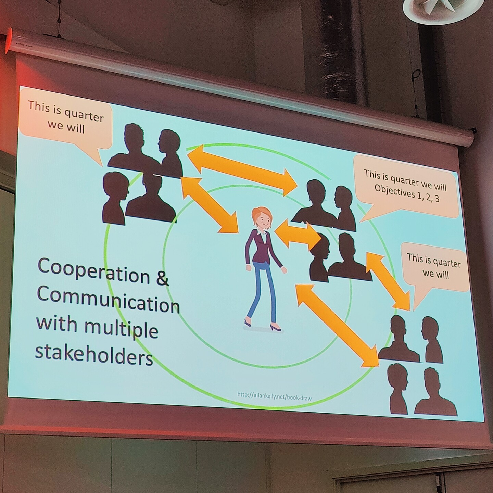

## Event API Products: Maximizing the Value of Your Event-Driven Architecture (Hari Rangarajan)

This talk was the only disappointing one. It was a product demo disguised as a
talk. To be fair, the
[talk description](https://oredev.org/sessions/event-api-products-maximizing-the-value-of-your-event-driven-architecture)
at the bottom mentioned that it "includes a demonstration of building and
consuming an event API product using Solace PubSub+ and AsyncAPI" but there was
little value for me from the introduction to event APIs, given that I already
have experience building them.

🐘 [Toot](https://chaos.social/@coderbyheart/109313513298707801)

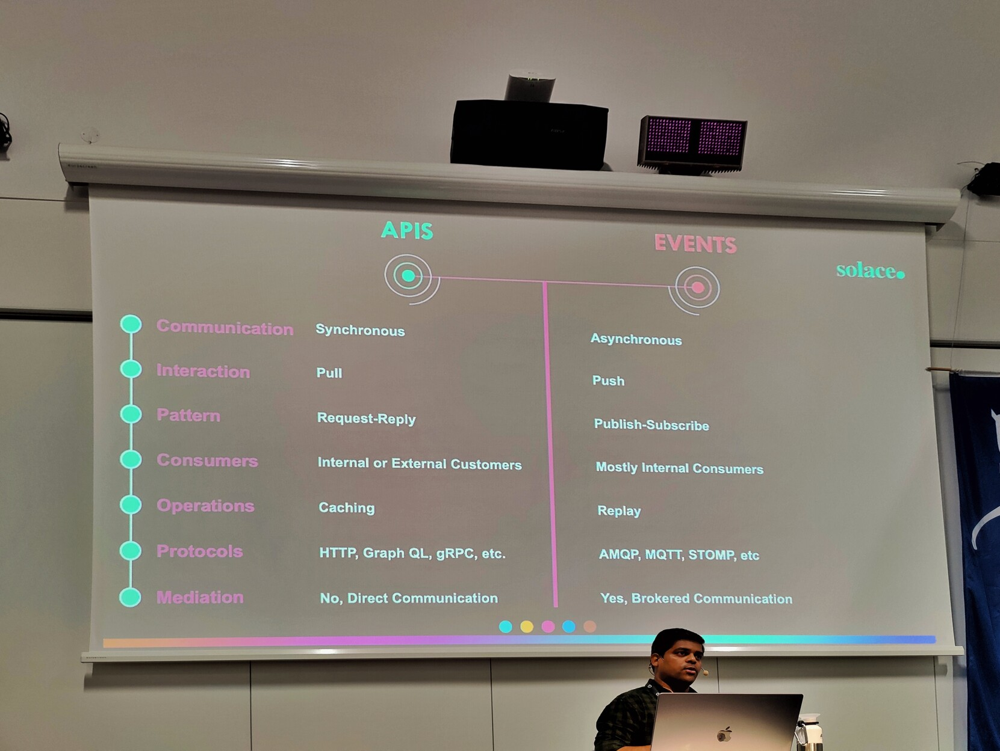

## Keep it simple! How to apply KISS principle in modern frontend (Nir Kaufman)

This
[session](https://oredev.org/sessions/keep-it-simple-how-to-apply-kiss-principle-in-modern-frontend)
by [Nir Kaufman](https://nir.life) was really fun.

Nir started with an quick history of frontend technologies. Then showed
Backbone.js as a simple example for a UI framework and showed how to use it with
React. That was 12 years ago. Now we have much more JavaScript libraries in our
frontend code. He proposed how to we can make it easier again.

- don't support all potential use cases, just the ones you need to support today
- not backwards compatibility

Keeps on to introduce
[WebComponents](https://developer.mozilla.org/en-US/docs/Web/Web_Components),
which are _today_ widely supported and provide a framework for reactive apps,
but has 0 dependencies, because it runs natively in browsers.

Nir proposes a lean stack using small, functional utilities that solve one thing
only and can be composed: A layered stack using [Preact](https://preactjs.com/)
for UI, [TypeScript](https://www.typescriptlang.org/) for Logic & state
mangement, and some functional UI libraries like [https://date-fns.org/],
[lodash](https://lodash.com/), and [Axios](https://github.com/axios/axios).

It was good to hear from an experienced frontend developer, that the way I
prefer to build frontend apps is sound, although I personally don't see the
value of Axios over fetch.

I found Nir at the party later and asked him why he in the end did not propose
WebComponents for his K.I.S.S. stack: in his experience it is still not ready
for production because it is challenging to integrate it with existing
libraries.

🐘 [Toot](https://chaos.social/@coderbyheart/109313834898159947)

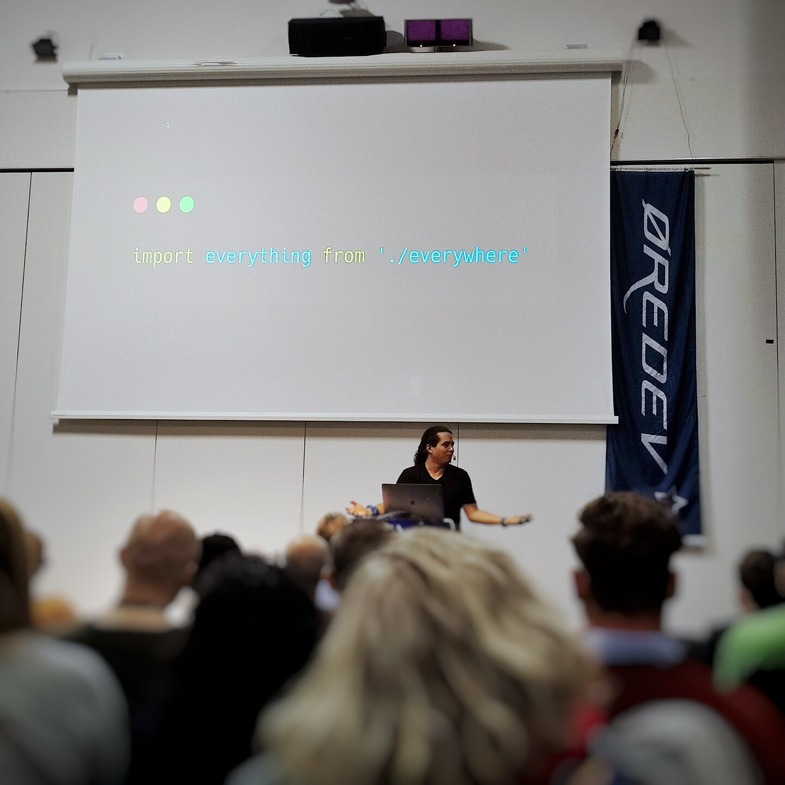

## Architecture for Flow with Wardley Mapping, DDD, and Team Topologies (Susanne Kaiser)

[Susanne Kaiser](https://www.susannekaiser.net/)'s
[talk](https://oredev.org/sessions/architecture-for-flow-with-wardley-mapping-ddd-and-team-topologies)
was intense and packed. She spoke about how to optimize architecture for flow,
using Wardley Mapping, Domain-Driven Design and Team Topologies.

First, we cannot improve the performance of a whole system by only improving the
individual parts. Therefore we need to understand how the individual components
work together to solve the user's needs, and which components need more
attention then others (because their are mature or commodities).

But, there is no software without people, so we also need to look at how to set
up the teams in a way that optimizes flow. This is where the work done in Team
Topologies comes into play. Combining that with the Wardley Map we can identify
areas in our project that changes often and therefore requires a high amount of
collaboration in order to achieve fast flow (of change). Now brining in DDD
which helps to subdivide the project into distinct domains allows to identify
value in each subdomains.

Combining these three techniques allows to get a good overview of the current
state. The goal is to have an architecture that is optimized for flow which
moves as much components to the right side of the map as sensible so teams can
focus on building the essential, and unique components that provide a
competitive advantage.

It's critical to identify which components can be moved to the commodity
segment, because if they are not there you might be spending too much money and
you are lagging behind the market.

Once this is done, there will be more resources to improve the core domain.

Susanne is working on a whole book about that which is supposed to come out next
year:
[Adaptive Systems with Domain-Driven Design, Wardley Mapping, and Team Topologies: Architecture for Flow](https://www.amazon.com/Adaptive-Systems-Domain-Driven-Wardley-Topologies/dp/0137393032).

My **main takeaway** was that combining these methodologies will yield
interesting insights into your current organization and help to map out where it
needs to go. A feedback loop is built-in which allows for course corrections
along the way. I definitely want to learn more about Wardley Maps and Team
Topologies (I am quite familiar with DDD).

🐘 [Toot](https://chaos.social/@coderbyheart/109314020245863628)

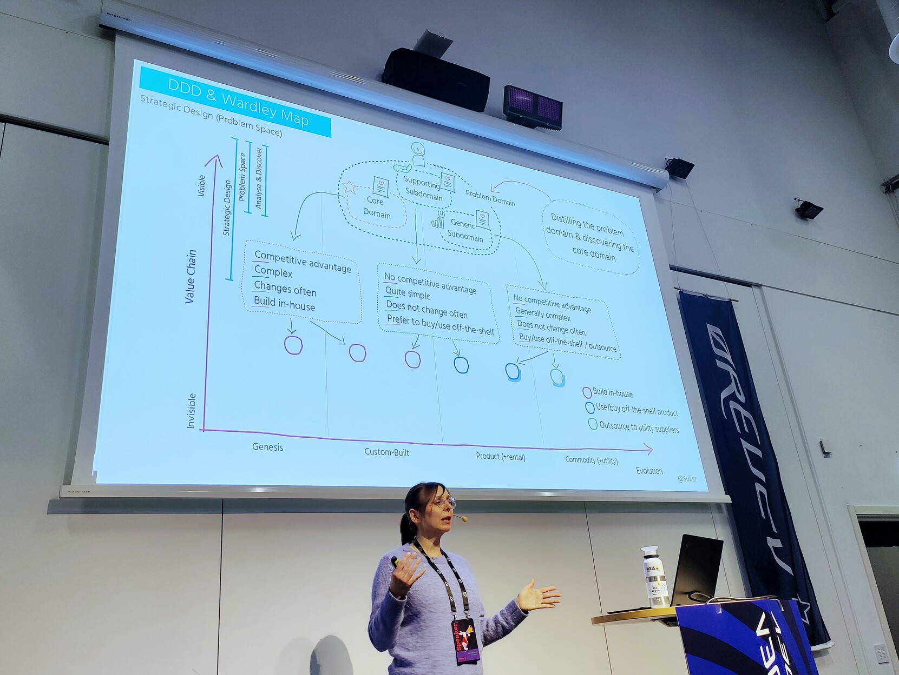

## Micro-frontends anti-patterns (Luca Mezzalira)

[Luca Mazzalira](https://lucamezzalira.com/) distilled the common mistakes he
has seen in his 7 years of experience working on Micro-frontends.

1. They should be independently deployable without coordination with other
   teams.
1. They should also be made for a certain business domain.
1. They all should use the same UI framework.
1. They should not implemented hacks for legacy components/microfrontends.
1. He mentions [Elm](https://elm-lang.org/) and
   [Cycle.JS](https://cycle.js.org/) as examples for good reactive UI
   implementations.
1. Microfrontends should not have bidirectional data flow.
1. Microfrontends don't share global state, they use events to communicate. This
   ensures loose coupling. They avoid calling the same APIs from multiple
   micro-frontends. This could be solved by merging two frontends or wrapping
   them in one parent container that provides the data to both.

When migrating to micro-frontends, sites can start with partial implementations,
e.g. only for certain sub-pathes (/catalog). This can be handled on the edge
(Reverse proxy).

Blog post with an outlook:
[The Future of Micro-Frontends](https://betterprogramming.pub/the-future-of-micro-frontends-2f527f97d506).

I personally was mostly curious what an experienced AWS engineer has to say
about micro-frontends, but I am currently not involved in a project where this
is needed.

🐘 [Toot](https://chaos.social/@coderbyheart/109314389163307614)

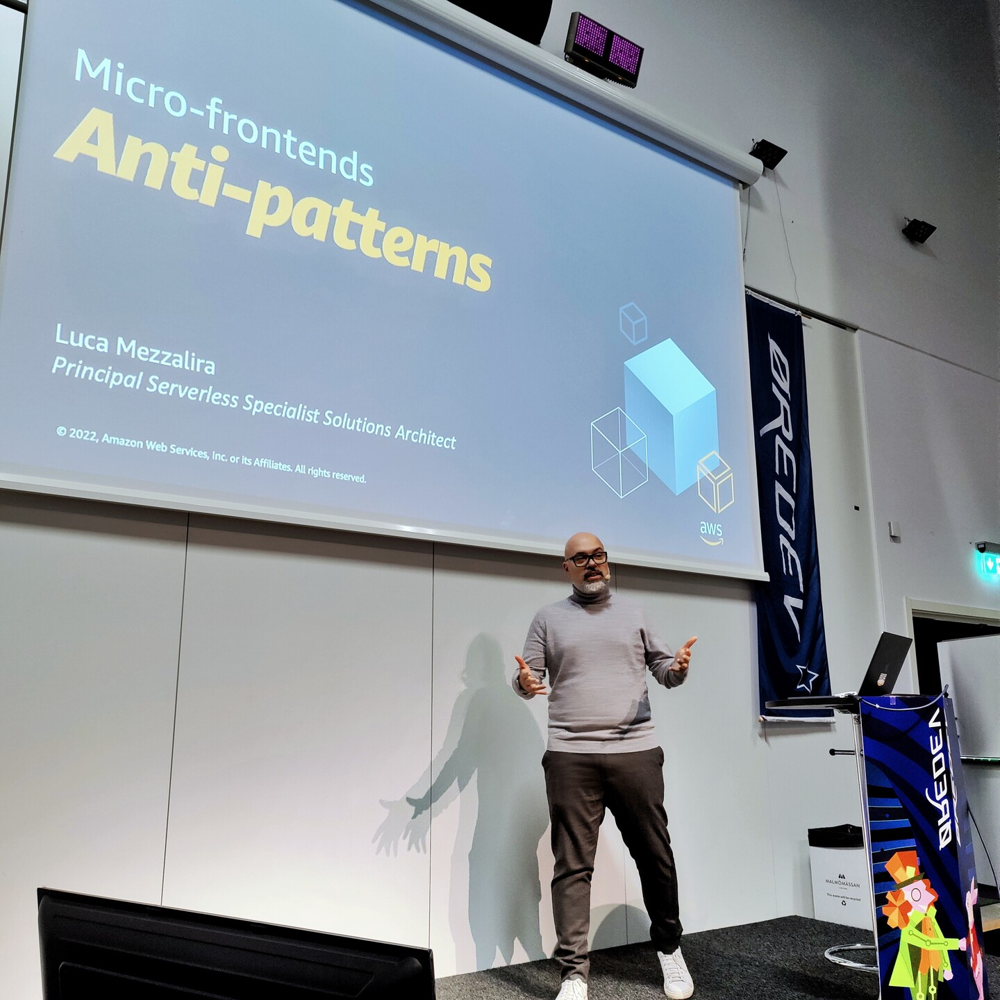

## How to get it right by being wrong all the time (Johan Öbrink)

[This talk](https://oredev.org/sessions/how-to-get-it-right-by-being-wrong-all-the-time)
by [Johan Öbrink](https://www.linkedin.com/in/johanobrink/) can be quickly
summarized: _talk to your users, from day 1_, but hearing an inside story from
one of Scandinavia's biggest banks on how they developed a mobile payment
solution was nevertheless interesting.

🐘 [Toot](https://chaos.social/@coderbyheart/109314650487703995)

## Playing with serverless and state - Let's create a serverless chatbot! (Karl Løland)

In this talk I got a first impression of Azure's Durable Functions, which allow
to simplify persisting state between invocations. It was helpful to understand
how to use them. Unfortunately the talk was in parts very slow because a lot of
boilerplate code was written during the talk in order to get the main points
across. I wished the coding would have been a recording so the speaker could
have focused on the details and skipped the uninteresting parts.

🐘 [Toot](https://chaos.social/@coderbyheart/109314813798276357)

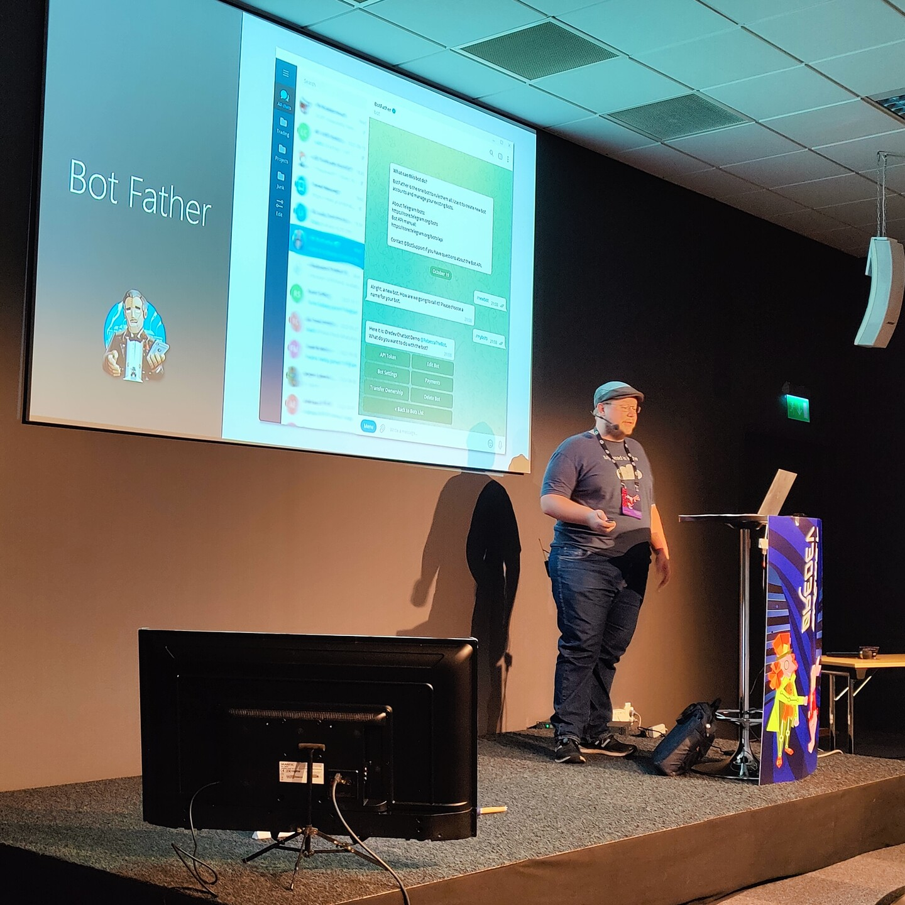

## Through the Looking Glass, or the Tech Revolution that Is (Emily Gorcenski)

The
[closing keynote of the second day](https://oredev.org/sessions/through-the-looking-glass-or-the-tech-revolution-that-is)
by [Emily Gorcenski](https://emilygorcenski.com/) was both inspiring and
interesting, but I will not attempt to summarize it, watch the recording, it's
going to be good good!

🐘 [Toot](https://chaos.social/@coderbyheart/109315124988943314)

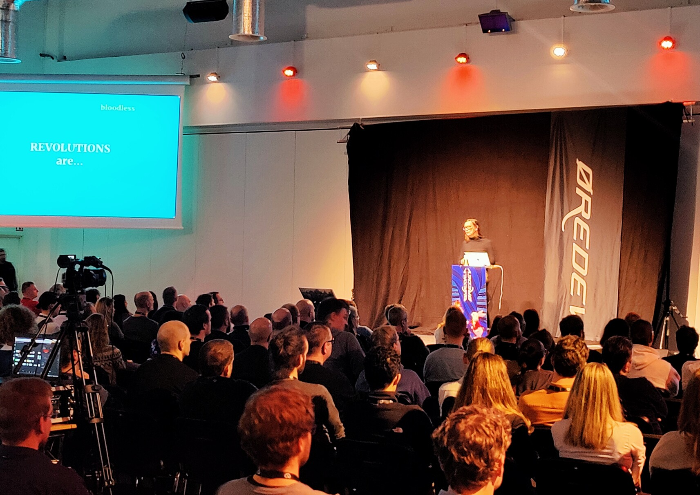

## The Ethical Engineer (Cennydd Bowles)

The keynote of day 3 was held by [Cennydd Bowles](https://cennydd.com) on
Ethics, and why we as engineers should care about it and what we can do to
follow good ethics principles.

The **main takeaway** for me was that there are many opportunities to take a
step back and consider the implications of the systems we (help) develop.

🐘 [Toot](https://chaos.social/@coderbyheart/109318645629554813)

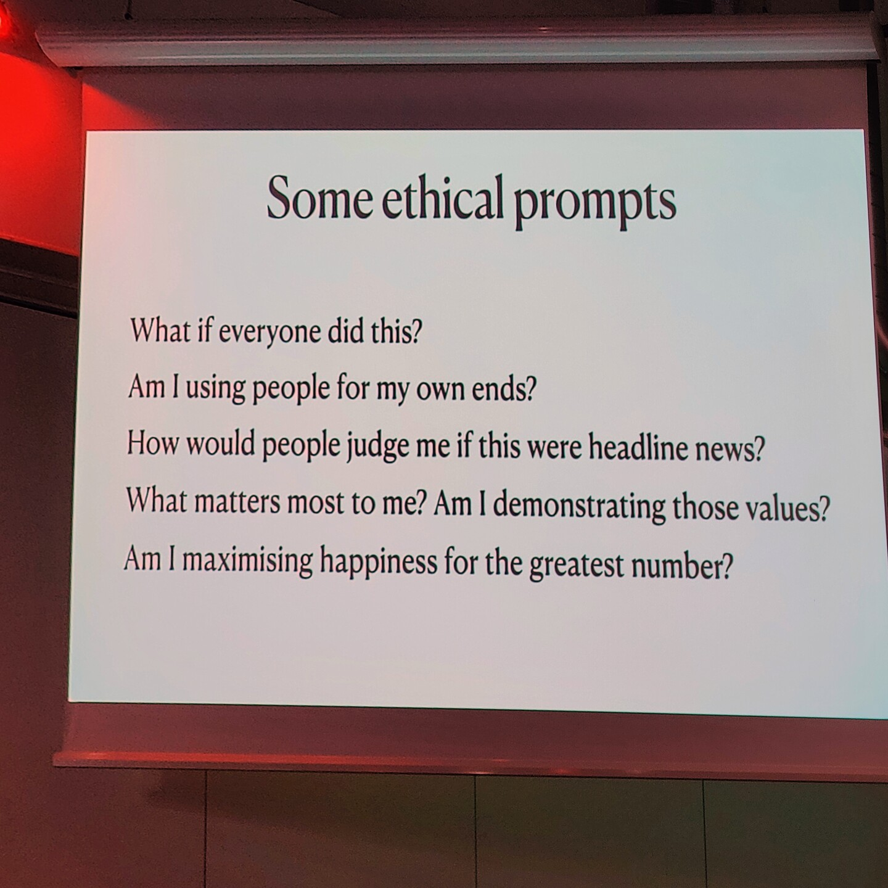

## Why one model can’t fit all - creating fulfilling engineering organizations (Heidi Helfand & Chris Smith & Susanne Kaiser)

This
[panel](https://oredev.org/sessions/why-one-model-can-t-fit-all-creating-fulfilling-engineering-organizations-panel)
was way too short because it was so interesting.

[Heidi Helfand](https://www.heidihelfand.com/),
[Susanne Kaiser](https://www.susannekaiser.net/), and
[Chris Smith](https://www.linkedin.com/in/chrissmithagile/) talked about how to
get started with improving and changing? Allow teams to experiment and find out
what is limiting then and what would work for them to improve, but still make
sure that they don't lose the alignment with the whole organization.

I got to ask a question on how to motivate people who do not have the need to
change and we kept the discussion going a bit even after the panel was over,
because it was way too short. The **main takeaway** here is to create motivators
by using team topologies and Wardley mapping to restructure teams in a way that
separates the people who do not want change from the ones that want and need to
adapt rapidly and through that creating both the stability reliable products
need from infrastructure, but also have people who want to work in more dynamic
settings be able to innovate. That way the innovators can quickly figure out the
path to the next successful iteration and can through that have good cause to
ask the "traditionalists" for help, which will then hopefully motivate them to
support the new efforts.

🐘 [Toot](https://chaos.social/@coderbyheart/109318904342872705)

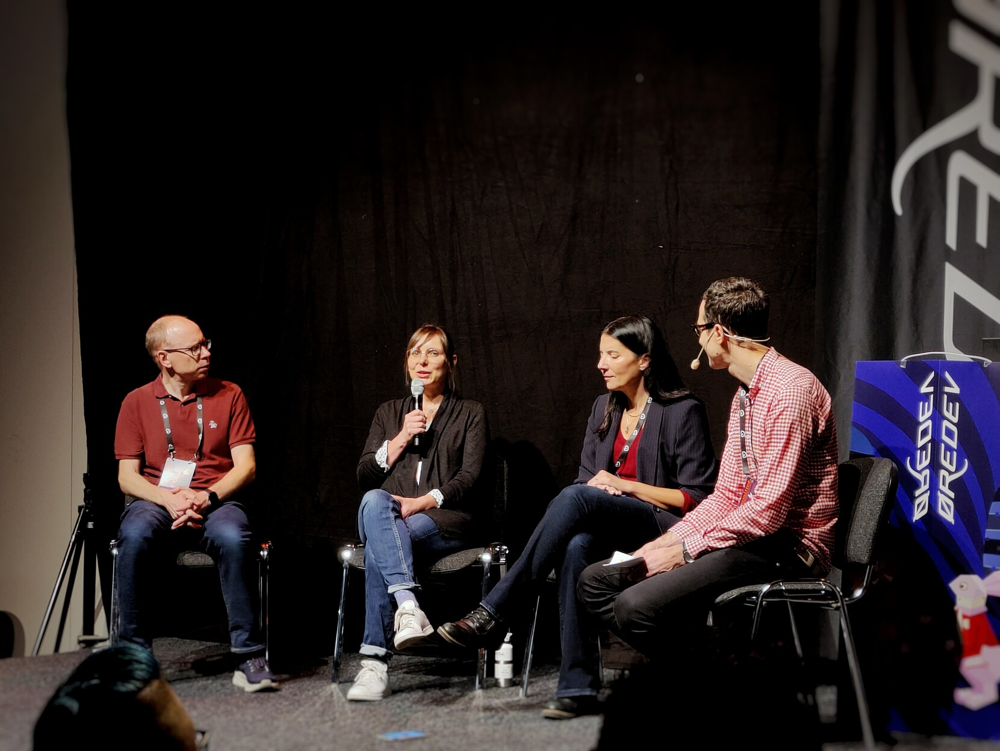

## Why should you care about WebAssembly? (Adrian Cole)

I went to
[this talk](https://oredev.org/sessions/why-should-you-care-about-webassembly-)
to get a quick update on the state of WebAssembly. While I do not have immediate
use for it it was interesting to see [an example](https://http-wasm.io/) of an
architecture build with it that allows plugins to be authored using code, which
allows much more flexibility compared to configuration and much more security
over using native plug-ins.

🐘 [Toot](https://chaos.social/@coderbyheart/109319213530214997)

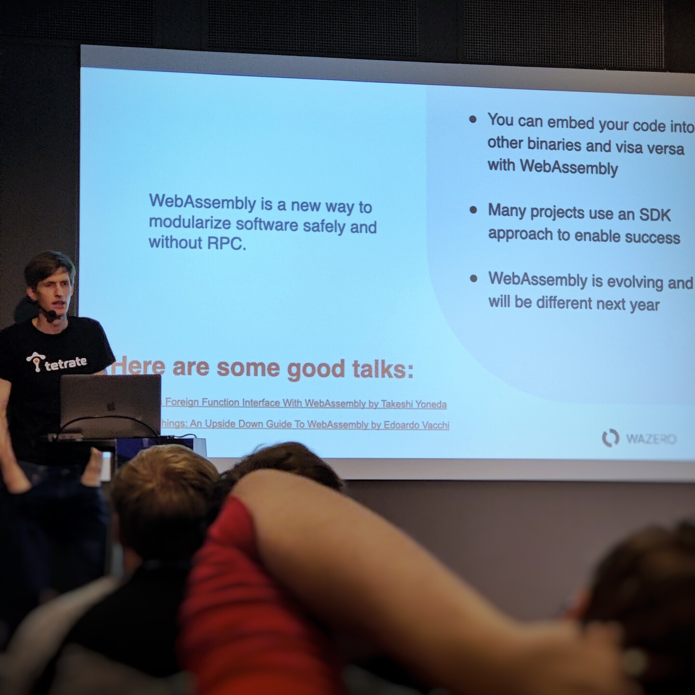

## Data Lake with AWS CDK (Krzysztof Slowinski)

Krzysztof Slowinski walked us through an
[AWS CDK based implementation of a data lake](https://oredev.org/sessions/data-lake-with-aws-cdk).

He is using S3 and data converted to the [Parquet](https://parquet.apache.org/)
format to make it more performant for querying.

The final CDK application involved many services, grouped in 8 stacks. Here CDK
really shines because it allows to define the solution in a higher level
language which allows us to easily re-use definitions.

For me there was not too much to take away, but it was great to chat to
Krzysztof a bit afterwards about his testing strategies for architectures like
this.

🐘 [Toot](https://chaos.social/@coderbyheart/109319517669995936)

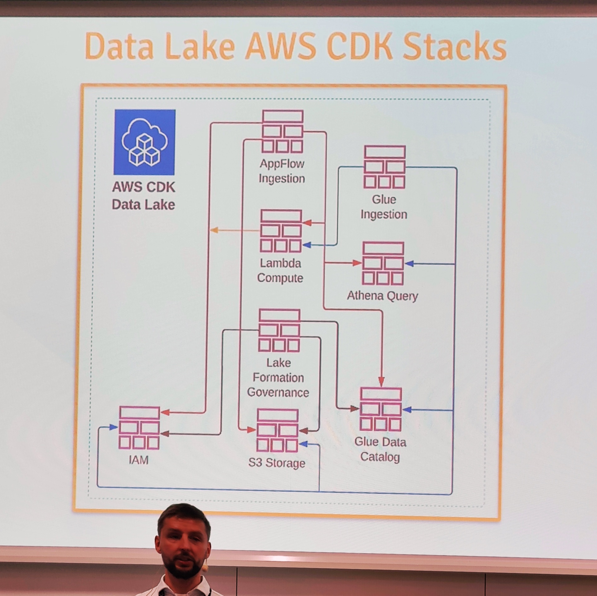

## Securing Journalists in 2022: Runa Sandvik

The [closing keynote](https://oredev.org/sessions/securing-journalists-in-2022)
was an interesting experience report from
[Runa Sandvik](https://runasandvik.com/) who works at the New York Times to
secure journalists.

She lead with an overview of the current state of technology which provides a
lot of tools that allow anonymous and secure communication possible relatively
easy. But it still requires work and making a mistake when using these tools
could have grave consequences for journalists. The tools have to become even
easier to use. It's also often unavoidable that journalists use personal tools.

Here's how you can help

- Google Summer of Code is still around!
- Crypto Parties? Let's bring them back
- The Tor Project, Freedom of the Press, Signal are hiring
- You can also secure at-risk people at a Big Tech company
- Try out the tools yourself, such as Lockdown Mode in iOS 16

The **main takeaway** for me was that even journalists, whose life depends on
secure communication will not do _everything_ to be safe. If the usability of a
tool is too bad, it will not be used. As engineers, we often prefer very
technical, precise solutions, but we cannot ignore the fact that we can
overburden users with too technical solutions.

🐘 [Toot](https://chaos.social/@coderbyheart/109319828032165141)

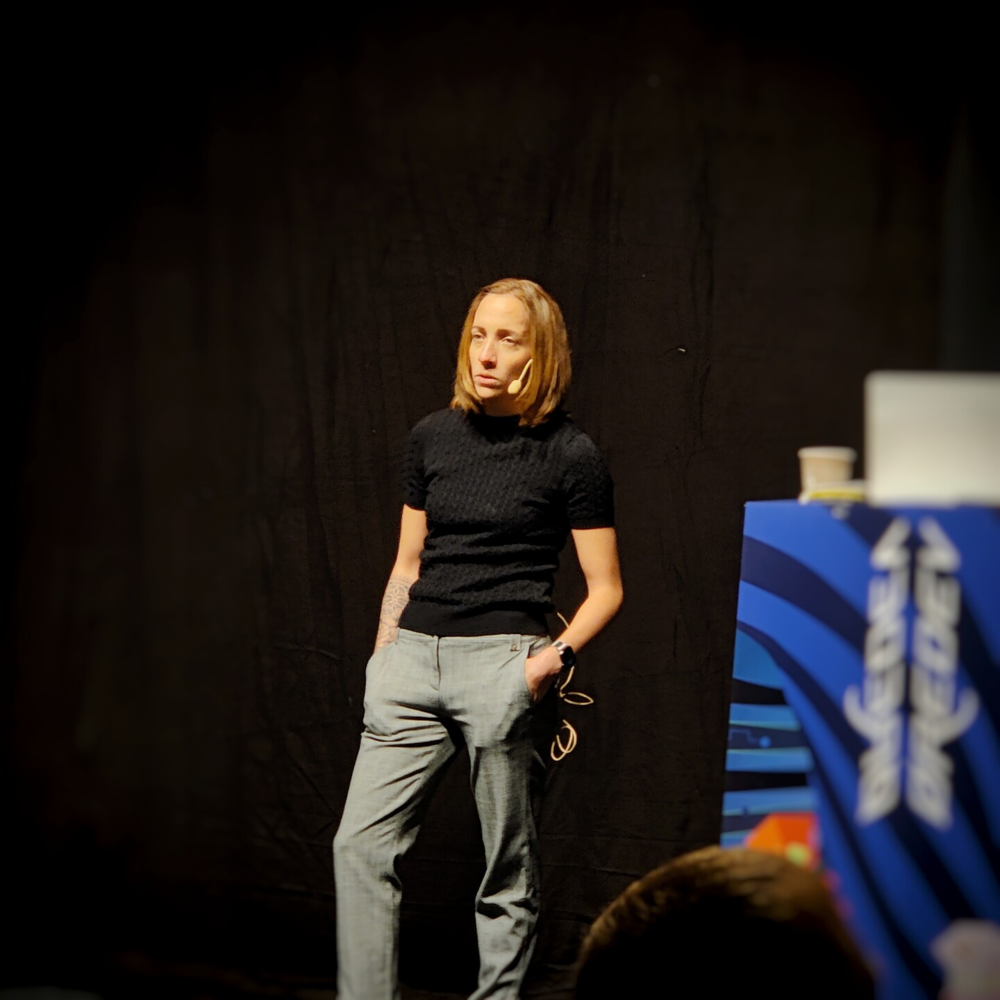

## Videos

Subscribe to
[Øredev's YouTube channel](https://www.youtube.com/c/%C3%98redevConference)
where the talk recordings will be published soon.

## Acknowledgements

My employer [Nordic Semiconductor](https://www.nordicsemi.com/) covered the
costs to attend the conference. Are you interested in a job that let's you
explore some of the most innovative connected technologies in the world? Check
out
[Nordic Semiconductor's career page](https://www.nordicsemi.com/About-us/Careers)!
